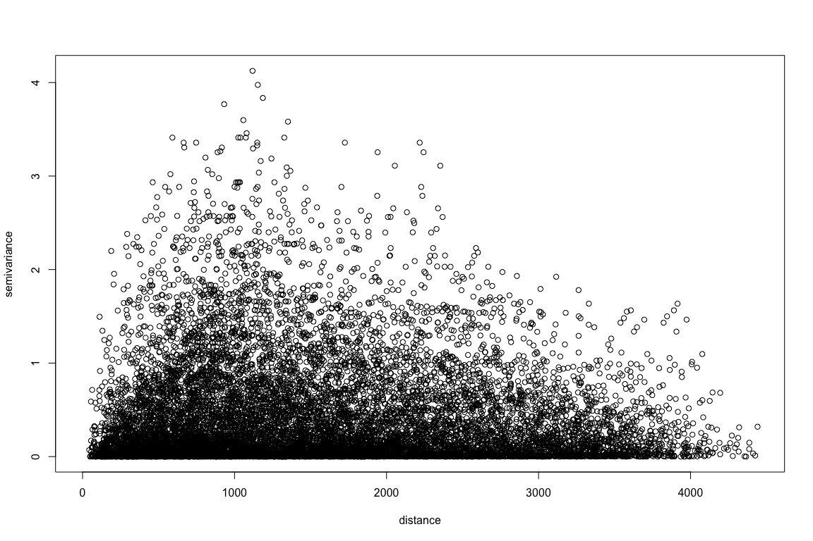
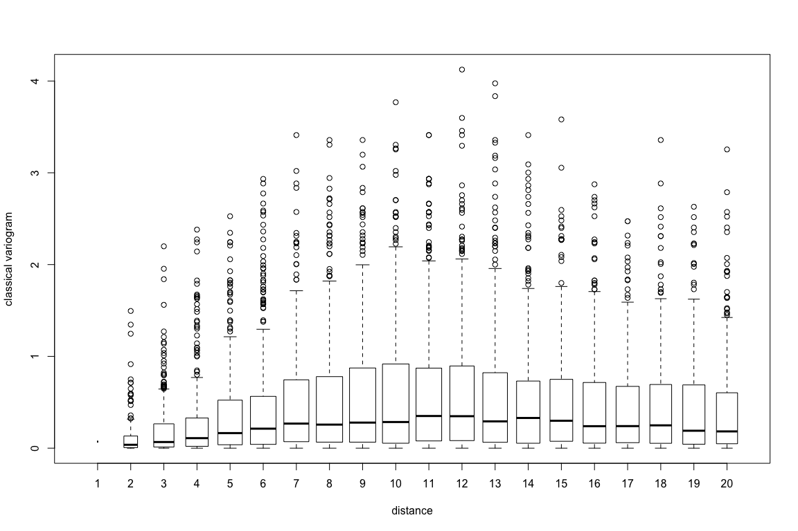
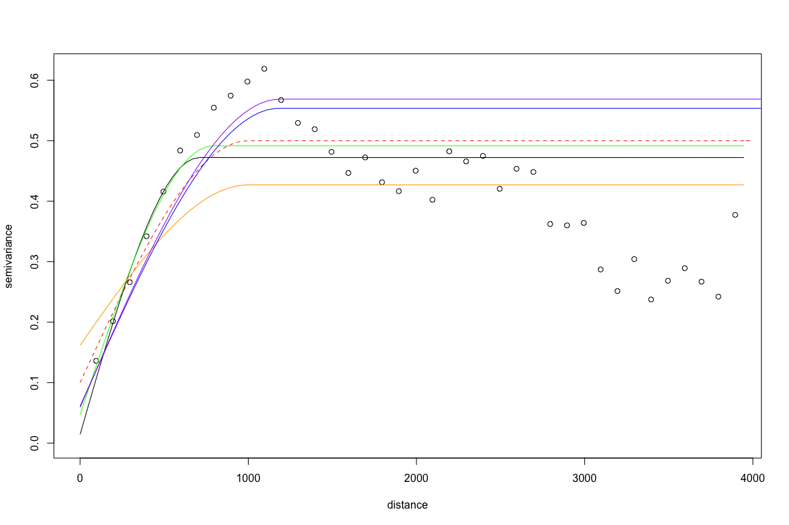
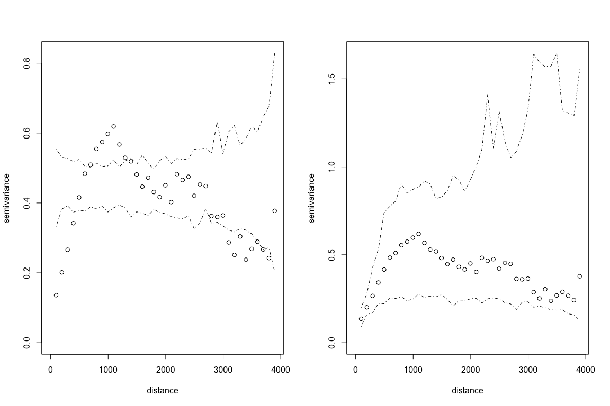
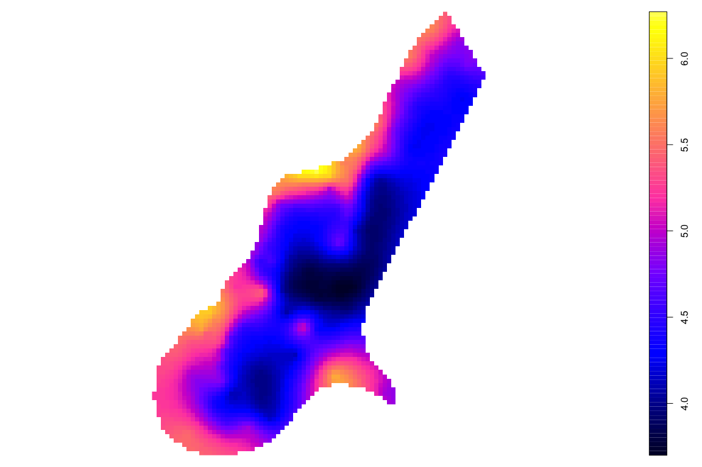
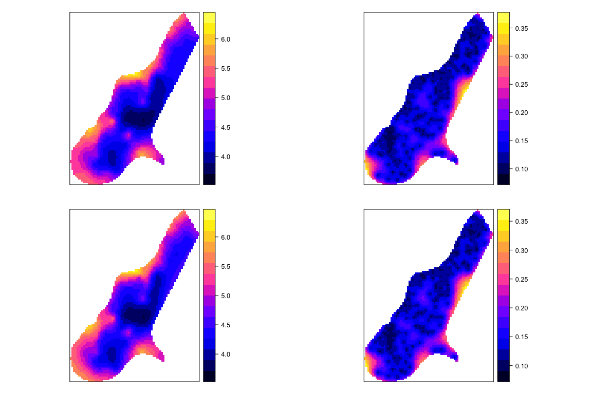
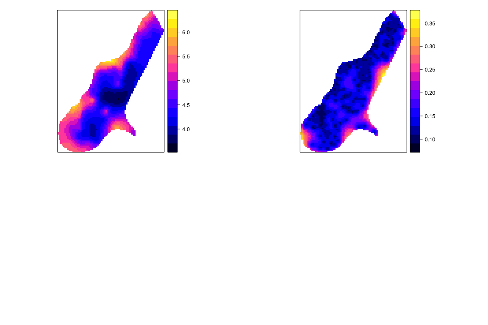

Week 7: Geostatistics II: Bayesian Kriging
================

    ## --------------------------------------------------------------
    ##  Analysis of Geostatistical Data
    ##  For an Introduction to geoR go to http://www.leg.ufpr.br/geoR
    ##  geoR version 1.7-5.2 (built on 2016-05-02) is now loaded
    ## --------------------------------------------------------------

More Notes on Assumption of Kriging
===================================

Stationarity
------------

Consider a spatial process *Z*(*s*) with a mean *m*(*s*) and variance *σ*<sup>2</sup>(*s*) exists ∀*s* ∈ 𝒟.

1.  The process is `strictly stationary` or `strongly stationary` if, for any given *n* ≥ 1, any set set of *n* sites and any *h* ∈ ℛ<sup>*d*</sup>, the distribution of *Z*(*s*<sub>*i*</sub>),…,*Z*(*s*<sub>*n*</sub>) is the same as *Z*(*s*<sub>*i*</sub> + *h*),…,*Z*(*s*<sub>*n*</sub> + *h*)

2.  A less restrictive assumption is `weak stationarity` or `second-order    stationarity`, which is to assume *m*(*s*)≡*μ* and *c**o**v*\[*Z*(*s*<sub>*i*</sub>),*Z*(*s*<sub>*i*</sub> + *h*)\] = *C*(*h*) for any *h* ∈ ℛ<sup>*d*</sup> s.t. both *s*<sub>*i*</sub> and *s*<sub>*i*</sub> + *h* are within 𝒟. *C*(*h*) is `covariogram`.

    -   *c**o**v*\[*Z*(*s*<sub>*i*</sub>),*Z*(*s*<sub>*i*</sub> + *h*)\] = *E*\[*Z*(*s*<sub>*i*</sub>)−*μ*\]\[*Z*(*s*<sub>*i*</sub> + *h*)−*μ*\] = *E*\[*Z*(*s*<sub>*i*</sub>)*Z*(*s*<sub>*i*</sub> + *h*)\] − *μ*<sup>2</sup> = *C*(*h*)
    -   *σ*<sup>2</sup>(*Z*(*s*<sub>*i*</sub>)) = *E*\[*Z*(*s*<sub>*i*</sub>)−*μ*\]<sup>2</sup> = *E*\[*Z*(*s*<sub>*i*</sub>)<sup>2</sup>\]−*μ*<sup>2</sup> = *C*(0)
    -   $\\rho(h)=\\frac{C(h)}{\\sigma(Z(s\_i))\\sigma(Z(s\_i+h))}$ is `correlogram`

3.  The `second-order stationarity` assumes the existence of covariance. For cases where covariance and variance do not exist, we assume the stationarity of the difference.

    -   *E*\[*Z*(*s*)\] = *μ*, ∀*s*
    -   *σ*<sup>2</sup>\[*Z*(*s*<sub>*i*</sub> + *h*)−*Z*(*s*<sub>*i*</sub>)\] = *E*\[*Z*(*s*<sub>*i*</sub> + *h*)−*Z*(*s*<sub>*i*</sub>)\]<sup>2</sup> = 2*γ*(*h*)
    -   $\\hat{\\gamma(h)}= \\frac{1}{2N(h)}\\sum\_{(s\_i, s\_j)\\in N(h)}^{N(h)}\[Z(s\_i)-Z(s\_j)\]^2$
    -   2*γ*(*h*) is called `variogram` and 2*γ*(*h*) is therefore `semivariogram`
    -   `intrinsic stationarity`

Variogram
---------

Not every function could be used as a variogram. Suppose there are stationary random variables *Z*(*s*<sub>1</sub>),*Z*(*s*<sub>2</sub>),…,*Z*(*s*<sub>*n*</sub>) with expectation *μ* and covariance *C*(*h*). Let *Y* be the linear combination of these variables. $Y=\\sum\_{i=1}^{n}\\omega\_iZ(s\_i)$, which is also a random variable itself and must have nonnegative variance.

$$\\sigma^2(Y)=\\sum\_{i=1}^{n}\\sum\_{j=1}^{n}\\omega\_i\\omega\_jC(s\_i-s\_j)\\ge 0$$

Therefore legal covariance functions much ensure that the variance of *Y* is always non-negative. This type of functions is often referred to as `non-negative definite`. If *σ*(*Y*)≥0, it is called `positive definite`.

Since for variogram *γ*(*h*)=*C*(0)−*C*(*h*). The variance of *Y*, *σ*<sup>2</sup>(*Y*), can be rewritten using *γ*(*h*):

$$\\sigma^2(Y) = C(0)\\sum\_{i=1}^{n}\\sum\_{j=1}^{n}\\omega\_i\\omega\_j - \\sum\_{i=1}^{n}\\sum\_{j=1}^{n}\\omega\_i\\omega\_j\\gamma(s\_i-s\_j)\\ge0$$

In case of $\\sum\_{i=1}^{n}\\sum\_{j=1}^{n}\\omega\_i\\omega\_j =0$:

$$\\sum\_{i=1}^{n}\\sum\_{j=1}^{n}\\omega\_i\\omega\_j\\gamma(s\_i-s\_j)\\le0$$

Therefore, legal variogram function must be `negative definite`.

The common examples of the legal variogram or covariogram functions include `Spherical`, `Exponential`, `Gaussian`, `Matern` that we have used for the last week.

Kriging
-------

Spatial prediction are commonly represented as:

*Y*(*s*)=*m*(*s*)+*Z*(*s*)+*ϵ*
,

where *Y*(*s*) represent the primary variable of study at location *s*, *m*(*s*)=*β**X*(*s*) is the mean or trend component (or trend) that could be modeled through covariate *X*(*s*), *Z*(*s*) is the spatial effect that are often assumed as Gaussian distributed specified by covariance functions *C*(*h*; *ϕ*, *σ*<sup>2</sup>), *ϵ* is the random noises (nugget effect) specified by parameter *τ*<sup>2</sup>

Different specifications of the trend component *m*(*s*) leads to different types of kriging methods.

-   Simple kriging: *m*(*s*)≡*μ*
-   Ordinary kriging: *m*(*s*) is constant but unknown
-   Regression kriging: *m*(*s*) is modeled through covariates *X*(*s*)
    -   Universal kriging
    -   Kriging with external drift

Under the assumption of Gaussian distributed variables, kriging leads to the unbiased linear estimation with minimum variance or best linear unbiased estimation (BLUE).

If the measurements cannot satisfy the Gaussian assumption, transformation usually needs to be performed first (e.g., log transform) or Bayesian hierarchical model can be used.

Model-based Geostatistics
=========================

``` r
data(meuse)
meuse=cbind(meuse, log(meuse$lead))
# convert it to a geodata object that geoR requires. 
meuse=as.geodata(meuse,coords.col=1:2, data.col=15, covar.col=8)
# generate variogram cloud. geoR provides two different ways for the sample
# variogram values, classical and modules. The classical one is the one we
# talked about in the class, and the modules one is the 
cloud1 <- variog(meuse, option = "cloud", estimation.type='classical')
names(cloud1)
head(cloud1$u, n=20)
head(cloud1$v, n=20)
plot(cloud1)
```



``` r
#box-plot of the cloud
bin1 <- variog(meuse, breaks=seq(45, 2000, by = 100), estimation.type='classical',bin.cloud=T, max.distance=2000) 
plot(bin1, bin.cloud=T)
```



``` r
#variogram fitting

##by eye
variogram <- variog(meuse, breaks=seq(45, 4000, by = 100))
plot(variogram)
lines.variomodel(cov.model="sph", cov.pars=c(0.4,1000), nug=0.1, max.dist=4000, lty=2, col='red')

#Fit the spherical variogram using the default option (check ?variofit manual).
fit1 <- variofit(variogram, cov.model="sph", ini.cov.pars=c(0.4,1000), fix.nugget=FALSE, nugget=0.1)

lines(fit1, lty=1)

#Use Cressies weights:
fit2 <- variofit(variogram, cov.model="sph", weights="cressie", ini.cov.pars=c(0.4,1000), fix.nugget=FALSE, nugget=0.1) 

lines(fit2, lty=1, col="green")

#Use equal weights (simply OLS):
fit3 <- variofit(variogram, cov.model="sph", ini.cov.pars=c(0.4,1000), weights="equal", fix.nugget=FALSE, nugget=0.1)

lines(fit3, lty=1, col="orange")

#MML:
ml <- likfit(meuse, cov.model="sph", ini.cov.pars=c(0.4,1000), fix.nugget=FALSE, nugget=0.1) 

lines(ml, col="blue")

#REML:
rml <- likfit(meuse, cov.model="sph", ini.cov.pars=c(0.4,1000), fix.nugget=FALSE, nugget=0.1, lik.method = "RML" )

lines(rml, col="purple")
```



``` r
# 
env.mc <- variog.mc.env(meuse, obj.var=variogram)
env.model <- variog.model.env(meuse, obj.var=variogram, model=fit2)
par(mfrow=c(1,2))
plot(variogram, envelope=env.mc)
plot(variogram, envelope=env.model)
```



``` r
# profile likelihood
#prof <- proflik(ml, geodata = meuse, sill.val = seq(0.20, 1, l = 5), range.val = seq(800, 1200, l = 6), uni.only = FALSE )
#plot(prof)
```

Simple Kriging and Ordinary Kriging
===================================

``` r
data(meuse.grid)
predSites=cbind(meuse.grid$x, meuse.grid$y)
OKpred=krige.conv(meuse, locations=predSites, krige=krige.control(type.krige='ok', obj.m=ml))

OKresult=as.data.frame(cbind(OKpred$predict, OKpred$krige.var))
coordinates(OKresult)=predSites
gridded(OKresult)=TRUE
plot(OKresult)
```



``` r
# the constant mean is specified by beta
mean(meuse$data)
SKpred=krige.conv(meuse, locations=predSites, krige=krige.control(type.krige='sk', obj.m=ml, beta=6)) 
SKresult=as.data.frame(cbind(SKpred$predict, SKpred$krige.var))
coordinates(SKresult)=predSites
gridded(SKresult)=TRUE

p1=spplot ( OKresult, "V1")
p2=spplot(OKresult,"V2")
p3=spplot(SKresult,"V1")
p4=spplot(SKresult,"V2")

print(p1, position = c(0,.5,.5,1),more=T)
print(p2, position = c(.5,.5,1,1),more = T)
print(p3, position = c(0,0,.5,0.5),more=T)
print(p4, position = c(.5,0,1,0.5))
```



Regression Kriging
==================

``` r
RKpred=krige.conv(meuse, locations=predSites, krige=krige.control(type.krige='ok', obj.m=ml, trend.d=~dist, trend.l= ~meuse.grid$dist)) 
RKresult=as.data.frame(cbind(RKpred$predict, RKpred$krige.var))
coordinates(RKresult)=predSites
gridded(RKresult)=TRUE

p5=spplot ( RKresult, "V1")
p6=spplot(RKresult,"V2")

print(p5, position = c(0,.5,.5,1),more=T)
print(p6, position = c(.5,.5,1,1))
```



Bayesian Kriging
================

``` r
#Warining: the following codes are very computationally demanding. In the
#interest of time,  I made the specification of the model unrealistically
# simple.

xrange=range(meuse$coords[,1])
yrange=range(meuse$coords[,2])
x=seq(xrange[1], xrange[2], length=10)
y=seq(yrange[1], yrange[2], length=10)
predSites=expand.grid(x,y)

#model.spec <- model.control(trend.d=~dist, trend.l=~meuse.grid$dist, cov.model="matern", kappa=0.5, lambda=1) 

model.spec <- model.control(cov.model="matern", kappa=0.5, lambda=1) 

prior.spec <- prior.control(beta.prior="flat",sigmasq.prior="reciprocal",tausq.rel.prior="uniform",tausq.rel.discrete=seq(from=0.0,to=1.0,by=0.1))

output.spec <- output.control(quantile=c(0.50,0.025,0.975), n.post=100, n.pred=100)

bayes1 <- krige.bayes(meuse, locations=predSites, borders=NULL, model=model.spec, prior=prior.spec, output=output.spec)

out <- bayes1$posterior
out <- out$sample
beta0.qnt <- quantile(out$beta0, c(0.50,0.025,0.975))
beta1.qnt <- quantile(out$beta1, c(0.50,0.025,0.975))
phi.qnt <- quantile(out$phi, c(0.50,0.025,0.975))
sigmasq.qnt <- quantile(out$sigmasq, c(0.50,0.025,0.975))
tausq.rel.qnt <- quantile(out$tausq.rel, c(0.50,0.025,0.975))
tausq <- (out$tausq.rel)*(out$sigmasq) 
tausq.qnt <- quantile(tausq, c(0.50,0.025,0.975))

samples.lead<- cbind(out$beta0,out$beta1,out$phi,out$sigmasq,tausq)
summary.lead <- rbind(beta0.qnt,beta1.qnt,phi.qnt,sigmasq.qnt,tausq.qnt)

out2 <- bayes1$predictive
predictive.mean <- out2$mean.simulations
predictive.variance <- out2$variance.simulations
predictive.sd <- sqrt(predictive.variance)
predictive.quantiles <- out2$quantiles.simulations


summary.predictive <- cbind(predictive.mean,predictive.sd,predictive.quantiles) 


test=as.data.frame(summary.predictive)
coordinates(test)=predSites
gridded(test)=TRUE

spplot(test, 'predictive.mean')
spplot(test, 'predictive.variance')
```
